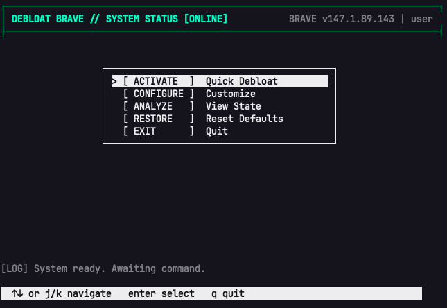
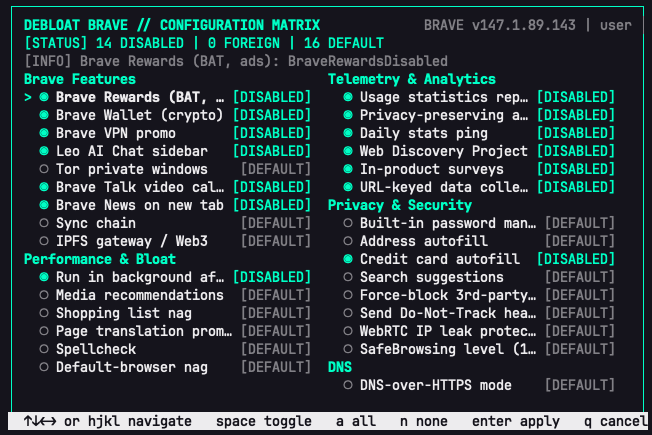

# Debloat Brave

[](https://github.com/valetivivek/Debloat-Brave/actions/workflows/shellcheck.yml)
[](./LICENSE)
[](https://github.com/valetivivek/Debloat-Brave)

**Zero-dependency Brave debloating.** Tweak Brave with inspectable scripts that turn off rewards, wallet promos, Leo, telemetry, nags, and more. macOS gets the cyber-minimalist Bash dashboard in [`debloat-brave.sh`](./debloat-brave.sh); Windows gets native PowerShell policy management in [`debloat-brave.ps1`](./debloat-brave.ps1).





## macOS install & run

```bash
curl -fsSL https://raw.githubusercontent.com/valetivivek/Debloat-Brave/main/install.sh | bash
debloat-brave
```

*Quit Brave first* when applying—some keys are read at launch. The tool can back up your plist to `~/.debloat-brave/` before the first write.

## macOS commands

| | |
|:--|:--|
| `debloat-brave` | Interactive menu |
| `debloat-brave --quick` | Sane preset, no menu |
| `debloat-brave --view` | Show current values for all managed keys |
| `debloat-brave --reset` | Remove all policy keys this tool manages |
| `debloat-brave --system` | Managed preferences (sudo; strongest UI removal) |
| `debloat-brave --dry-run` | Print what would run |
| `debloat-brave --yes` | No prompts (good for scripts) |

In **Customize**: `↑` `↓` `←` `→` or `h` `j` `k` `l` to move through the configuration matrix, `space` to toggle, `a` to select all, `n` to select none, `enter` to apply, `q` to cancel.

## Windows PowerShell

Windows support uses Brave policy registry keys under `HKCU:\Software\Policies\BraveSoftware\Brave` by default. Add `-System` to use `HKLM:\Software\Policies\BraveSoftware\Brave` from an elevated PowerShell session.

```powershell
powershell -ExecutionPolicy Bypass -File .\debloat-brave.ps1 -DryRun -Quick -Yes
powershell -ExecutionPolicy Bypass -File .\debloat-brave.ps1 -Quick
powershell -ExecutionPolicy Bypass -File .\debloat-brave.ps1 -View
powershell -ExecutionPolicy Bypass -File .\debloat-brave.ps1 -Reset
```

Use `-DryRun` first to preview registry changes. Relaunch Brave after applying or resetting policies.

## Platform support

| Platform | Mechanism | Status |
|:--|:--|:--|
| **macOS** | `defaults write` plus PlistBuddy for managed policy | Supported |
| **Linux** | `/etc/brave/policies/managed/` JSON file | Planned for v2 |
| **Windows** | Registry keys under `HKCU/HKLM\SOFTWARE\Policies\BraveSoftware\Brave` | Supported via PowerShell |

## macOS uninstall

```bash
bash uninstall.sh
```

On Windows, run `.\debloat-brave.ps1 -Reset` for user policy keys or `.\debloat-brave.ps1 -System -Reset` from elevated PowerShell for machine policy keys.

## Contribute

See [CONTRIBUTING.md](./CONTRIBUTING.md). PRs welcome; run `shellcheck debloat-brave.sh install.sh uninstall.sh` before opening one.

## License

MIT — see [LICENSE](./LICENSE).
